[Click aqui para ver el documento en Español](es_README.md)  
[Clickez ici pour lire le document traduit au français](fr_README.md)

> Note: This project is a prototype developed for an industrial application involving quality control of a specific product, but it was initially focused on the same LED detection as in [LedType-detection](https://github.com/IsmaTIBU/LedType-detection/tree/main) for a clearer view of its capabilities and limitations when dealing with an AI model integrated into a board. However, the model obtained based on LED detection is perfectly extrapolable to quality control related to any other board element.

# Index
### - [The Hardware](#what-is-the-8mplus-bb)
### - [The Software](#current-program-functionality)
### - [Model Training](#model-training)
### - [Model Results](#results-with-model-loaded-on-computer)
### - [Possible Improvements](#two-possible-solutions)

### What is the 8MPLUS-BB?
It is a professional development board from NXP based on the i.MX 8M Plus processor, specifically designed for AI and machine learning applications in edge computing.

[Link to datasheet](https://www.nxp.com/products/IMX8MPLUS)

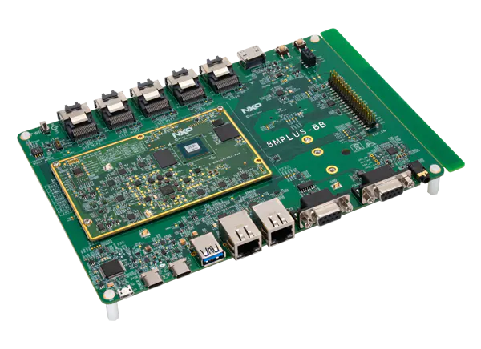

#### Main processor:
CPU: ARM Cortex-A53 quad-core up to 1.8 GHz  
GPU: Vivante GC7000UL (3D graphics and acceleration)  
NPU: Neural Processing Unit of 2.3 TOPS for AI  
VPU: Video Processing Unit for H.264/H.265 encoding/decoding  

### Key capabilities:
AI/ML: Dedicated NPU that accelerates models in .tflite format (TensorFlow Lite)  
Vision: Multiple cameras, real-time image processing  
Audio: Dedicated DSP for advanced audio processing  
Connectivity: Ethernet, WiFi, Bluetooth, multiple USB  
Displays: Support for multiple simultaneous displays  

## Current program functionality 
### First of all, load [modelo_convertido.tflite](https://github.com/IsmaTIBU/Embedded_AI/releases/tag/Tflite_model) in the same directory as the programs.
NPU-CPU.py: Analyzes the performance of the model loaded in the code to confirm if it is well optimized for use with the system's NPU or CPU.     
camAI_CPU.py: Performs image classification using the CPU. Shows the latency of the loaded model and the accuracy of its predictions in real time.  
camAI_NPU.py: Performs image classification using the NPU. Shows the latency of the loaded model and the accuracy of its predictions in real time.  

### File execution
Run python files with ```python3 [file]```

## File transfer example

Board IP: 194.178.59.125  
My IP: 194.178.59.38

Repository architecture on computer:
```
Embedded_AI
    |-------NPU-CPU.py
    |-------camAI_CPU.py
    |-------camAI_NPU.py
    |-------README.md
```

Current directory architecture on the board:
```
PlacaKepar
    |-------NPU-CPU.py
    |-------camAI_CPU.py
    |-------camAI_NPU.py
    |-------modelo_convertido.tflite
```

#### To send from computer (Windows)
From computer run:
```
cd Embedded_AI
python -m http.server 8000
```

From board run:
```
cd PlacaKepar
wget http://194.178.59.38:8000/[File]
```

#### To send from board (Linux - yocto)
From computer run:
```
cd Embedded_AI
Invoke-WebRequest -Uri "http://194.178.59.125:8000/[File]" -OutFile "[File]"
```

From board run:
```
cd PlacaKepar
python3 -m http.server 8000
```

## Model training
The model was entirely developed with Tensorflow and Keras. The main objective was to develop an efficient model for the task that wouldn't weigh too much, complicating its architecture as little as possible but obtaining correct results. The current model has just over 900k parameters trained during its fine-tuning.

<table>
<tr>
<td>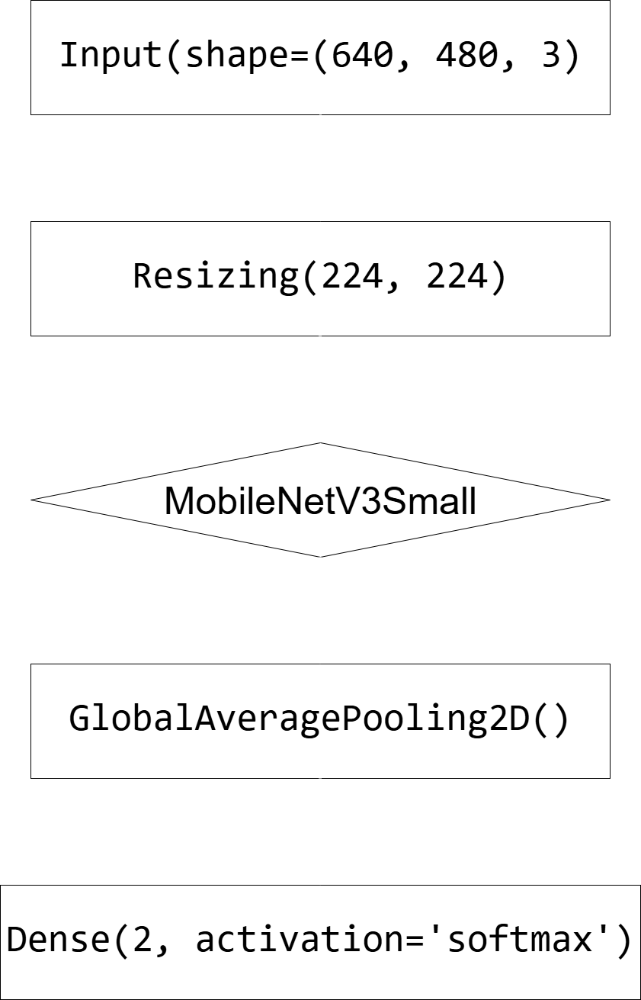</td>
<td>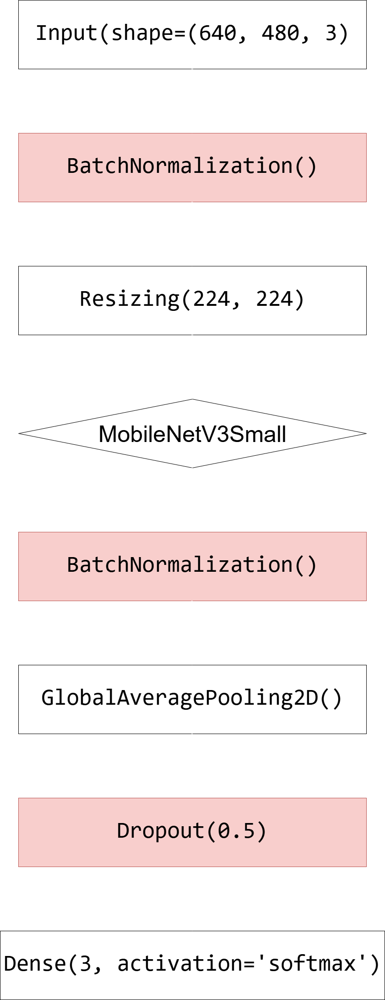</td>
</tr>
<tr>
<td colspan="2" align="center">
  <em>Model architecture change<br>to smooth training and validation curves</em>
</td>
</tr>
</table>

<table>
<tr>
<td>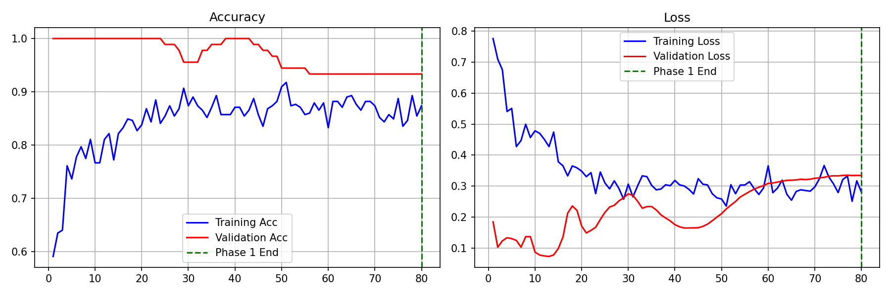</td>
</tr>
<tr>
<td>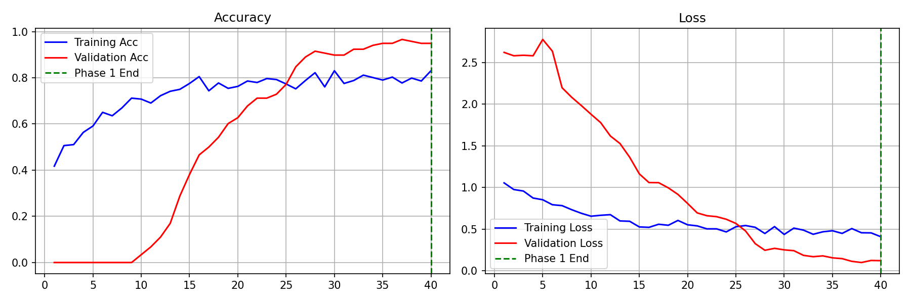</td>
</tr>
<tr>
<td colspan="2" align="center"><em>Initial model and final model training results</em></td>
</tr>
</table>

<table>
<tr>
<td></td>
<td></td>
</tr>
<tr>
<td colspan="2" align="center"><em>Detection results between a .keras model and .tflite model</em></td>
</tr>
</table>

|          |.keras model|.tflite model|
|----------|-----------|------------|
|Weight|11.3 MB|1.05 MB|
|Precision|100 %|98.59 %|
|Average confidence|97.5 %|94.2 %|
|Maximum confidence|100 %|99.9 %|
|Minimum confidence|77.3 %|50.2 %|

These results could improve, especially for the .tflite format model, by considerably increasing the dataset (currently we only have 590 training images).

## Results with model loaded on computer 
### Camera used: [ELP 5MP HD USB Camera](https://www.elpcctv.com/elp-5mp-hd-usb-camera-board-free-driver-usb-camera-module-with-ov5640-sensor-elpusb500w02ml21-p-51.html)
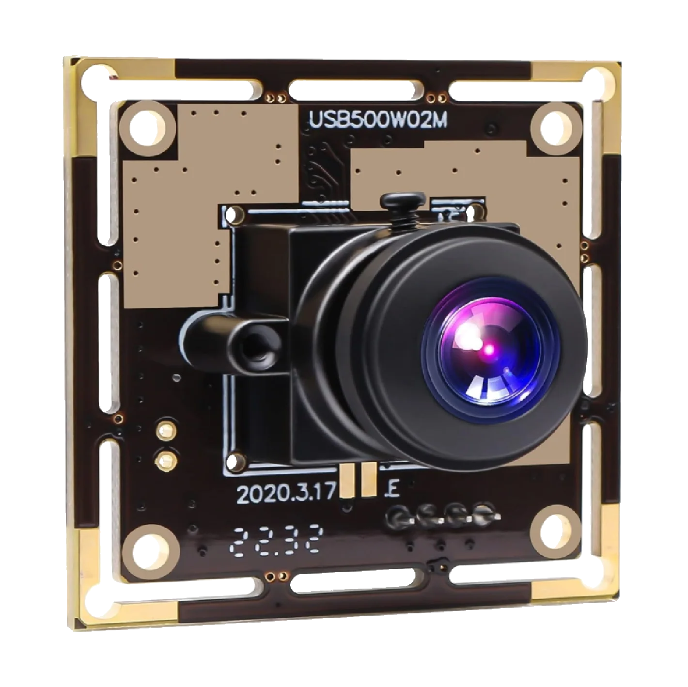

<table>
<tr>
<td></td>
<td></td>
</tr>
<tr>
<td colspan="2" align="center"><em>Real-time detection results of a .keras model and .tflite model </em></td>
</tr>
</table>

## Results with model integrated on the board
### Camera used: [4K MIPI CMOS Camera](https://www.nxp.com/design/design-center/development-boards-and-designs/4K-MIPI-CMOS-CAMERA-MODULE) 
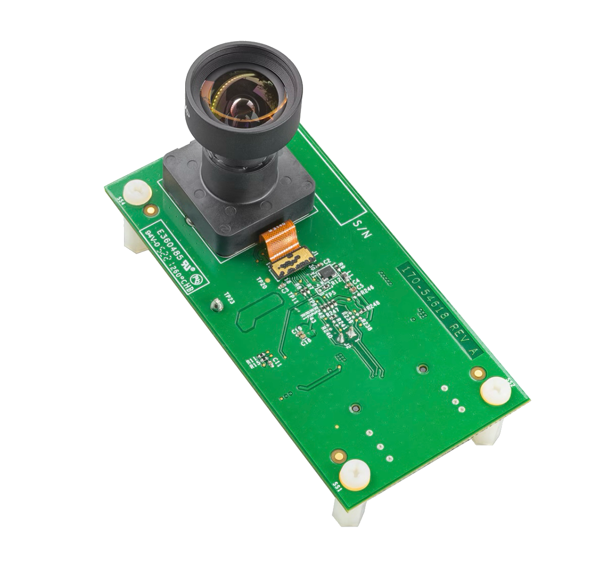

<table>
<tr>
<td>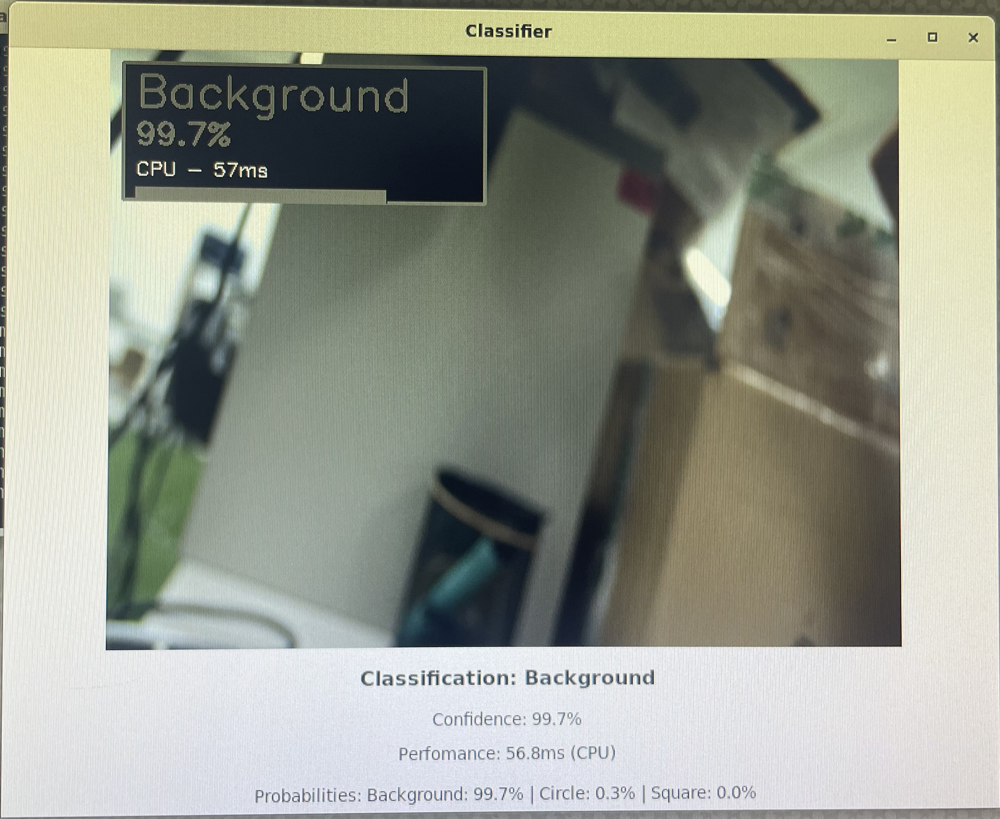</td>
<td>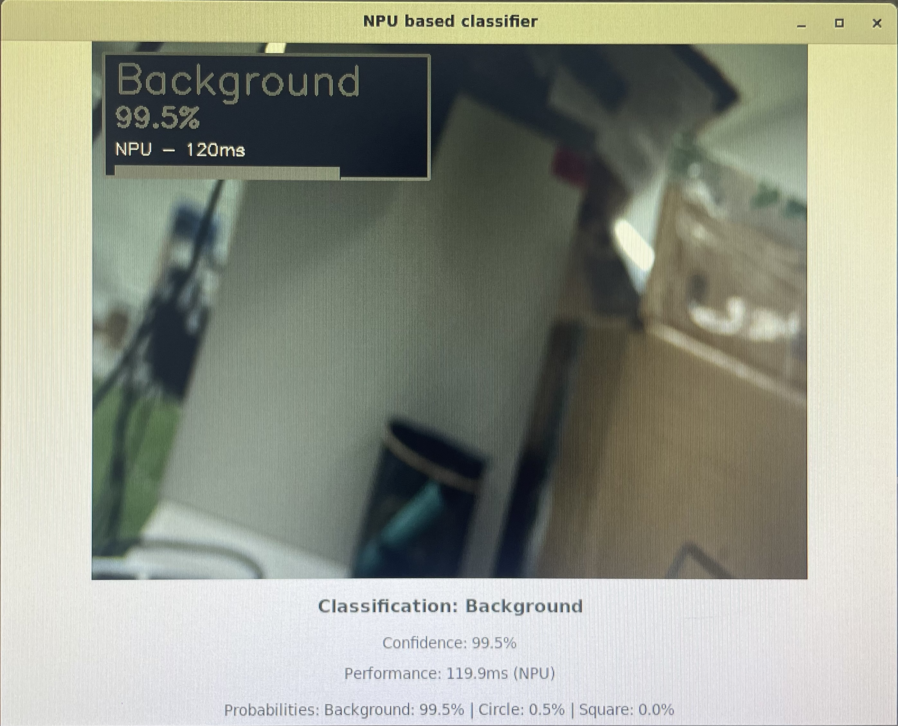</td>
</tr>
<tr>
<td>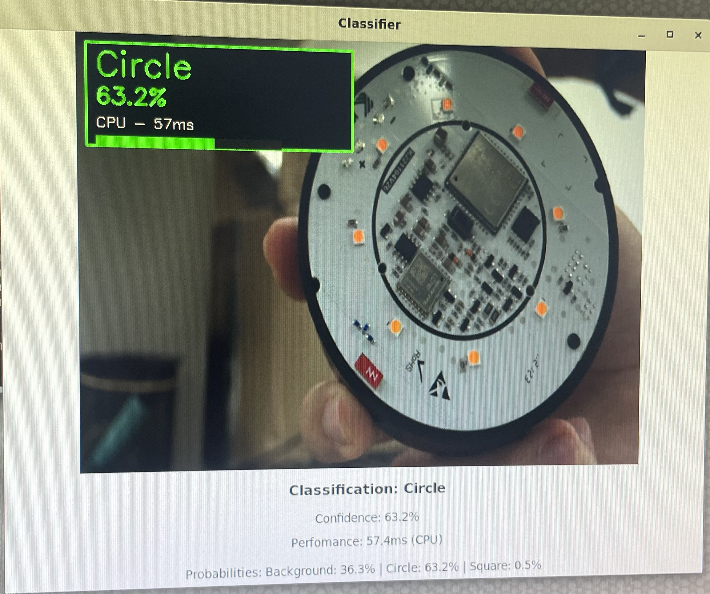</td>
<td>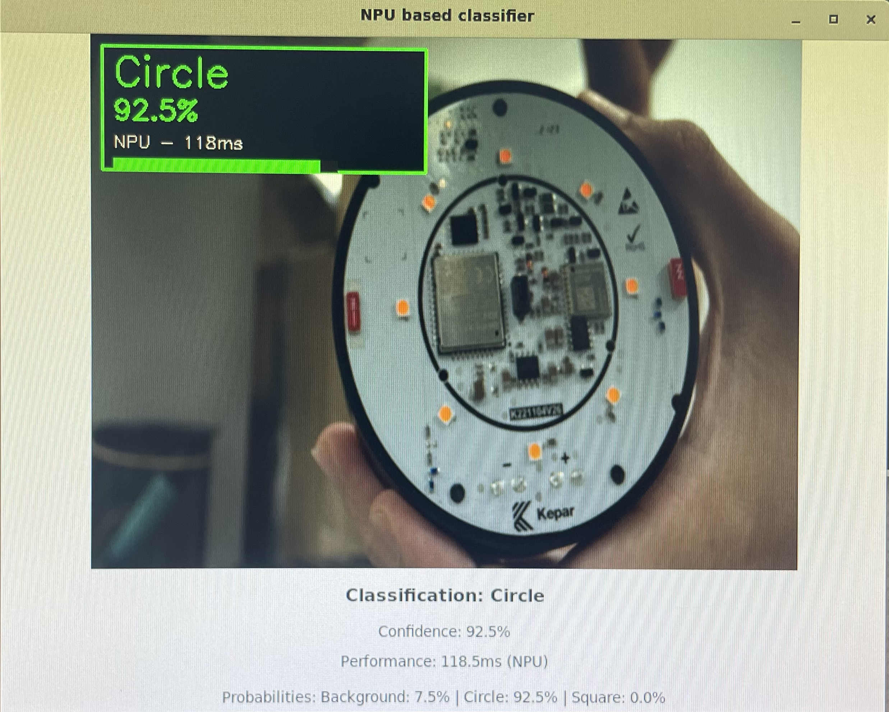</td>
</tr>
<tr>
<td>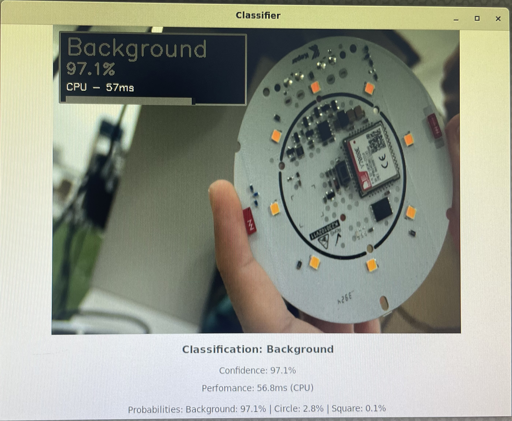</td>
<td>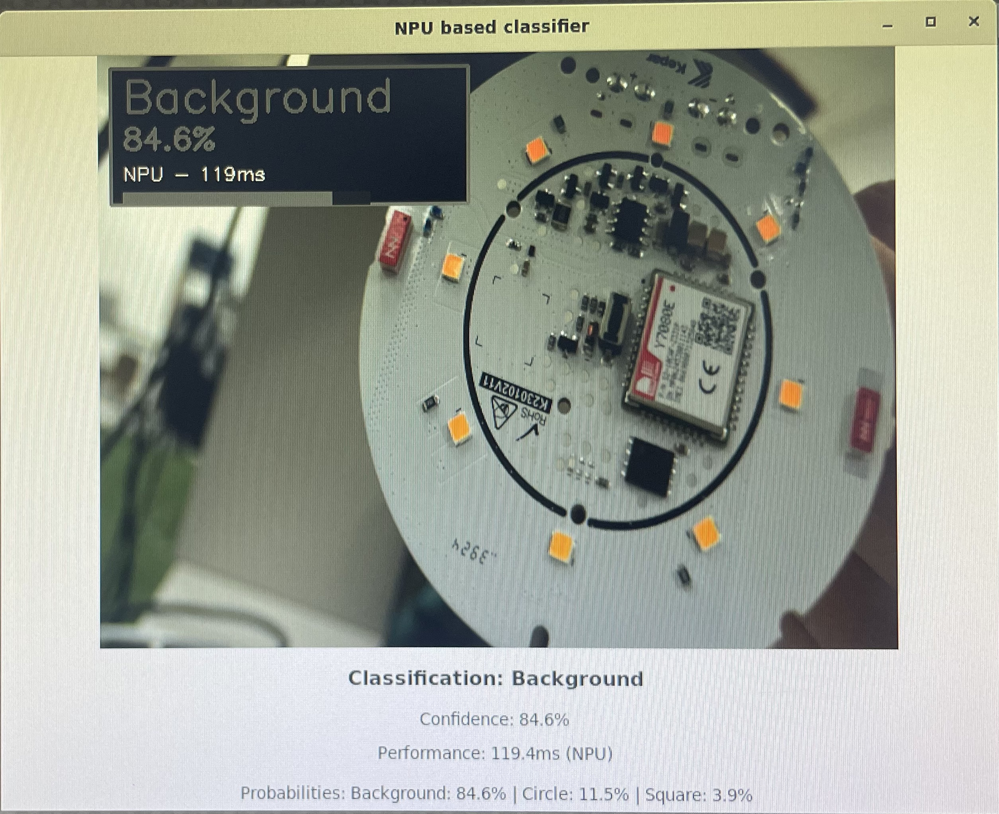</td>
</tr>
<tr>
<td colspan="2" align="center">
  <em>Detection of background, circular and square LEDs on the NXP board using CPU or NPU</em>
</td>
</tr>
</table>

As I have mentioned, for now this is nothing more than a prototype to become familiar with these concepts and to use the board as soon as possible, but there is clearly a performance difference between CPU and NPU detections, with the latter being much slower (~ x2.07) when it shouldn't be. There will then be optimization errors to debug, even if fortunately for our case the current model is so light that it runs fast enough on CPU.
In addition to that, square LEDs are never detected, even though it's the same model that, as we have seen before, had very high precision. This is most likely due to a dataset that is not well "specialized" for that camera. The best thing would be to use the same camera that would be used for detection to take the photos used to build the dataset. The location is also crucial since it will be reflected in lighting changes and reflections captured by the camera.

### Two possible solutions:
1. Create a much more extensive dataset (~2000-3000 training images) in which photos with very different light intensity are implemented.  
   **- Pros:** It would most likely be a dataset that would work with almost any type of camera under almost any type of conditions.  
   **- Cons:** Building a dataset of that magnitude would take quite a bit of time (approximately 1 week, not counting possible labeling errors from rushing).
2. Create a specialized dataset (~500-600 training images) to be used only with that camera. The photos should be taken with that camera under the conditions and location where it would be placed.  
   **- Pros:** Building that dataset would take much less time (approximately 1 day). Also, being a "specialized" dataset, the accuracy of predictions would always be very high.  
   **- Cons:** "Specialized" dataset so it could not be used for other locations or cameras. Either performance drops would be seen or more images would have to be implemented to the dataset if it is desired to be used for other cases.


